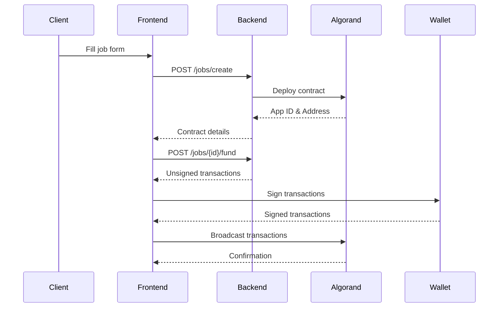
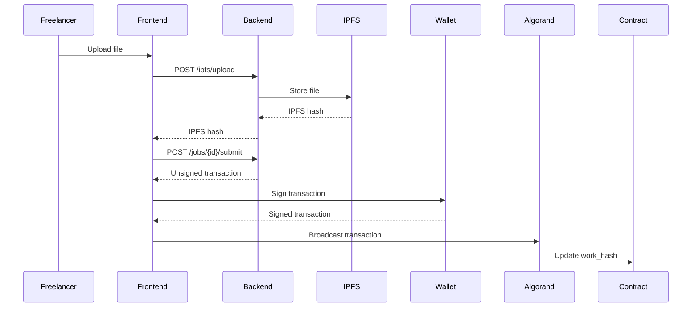
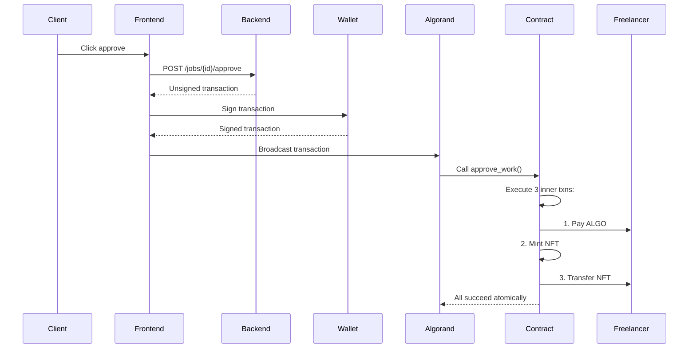

# AlgoFreelance Integration Guide

This document outlines the frontend-backend integration that has been completed.

## Overview

The AlgoFreelance application is now fully integrated with:
- **Smart Contract**: Deployed on Algorand (located in `projects/AlgoFreelance-contracts`)
- **Backend API**: FastAPI server (located in `projects/AlgoFreelance-backend`)
- **Frontend**: React + Vite application (located in `projects/AlgoFreelance-frontend`)

## Integration Components

### 1. API Client (`frontend/src/services/api.ts`)
- Centralized API client for all backend communication
- Type-safe requests using TypeScript interfaces
- Error handling with custom `ApiError` class
- Endpoints:
  - `POST /api/v1/jobs/create` - Create new job contract
  - `GET /api/v1/jobs/{app_id}` - Get job details
  - `GET /api/v1/jobs` - List all jobs with filters
  - `GET /api/v1/freelancers/{address}/nfts` - Get freelancer portfolio
  - `POST /api/v1/jobs/{app_id}/fund` - Construct fund transaction
  - `POST /api/v1/jobs/{app_id}/submit` - Construct submit work transaction
  - `POST /api/v1/jobs/{app_id}/approve` - Construct approve work transaction
  - `POST /api/v1/ipfs/upload` - Upload file to IPFS

### 2. TypeScript Types (`frontend/src/types/job.ts`)
- Mirrors backend Pydantic models
- Provides type safety across the frontend
- Includes job status enums and helper mappings

### 3. IPFS Service (`frontend/src/services/ipfs.ts`)
- Wrapper around IPFS/Pinata integration
- File upload functionality
- Gateway URL generation for viewing deliverables
- IPFS hash validation

### 4. Pages

#### CreateJobPage (`frontend/src/pages/CreateJobPage.tsx`)
**User Flow:**
1. Client fills in job details (title, description, freelancer address, payment)
2. Backend deploys smart contract
3. Client signs and sends funding transaction
4. Job is created and funded

**Features:**
- Form validation
- Real-time ALGO/microALGO conversion
- Two-step process (create → fund)
- Success screen with navigation options

#### JobListPage (`frontend/src/pages/JobListPage.tsx`)
**Features:**
- Display all jobs from the blockchain
- Filter by status (Created, Funded, Submitted, Completed)
- Filter by user (show only my jobs)
- Pagination support
- Job cards with status indicators

#### JobDetailsPage (`frontend/src/pages/JobDetailsPage.tsx`)
**User Flow - Freelancer:**
1. View job details and status
2. Upload deliverable file to IPFS
3. Submit work transaction
4. Wait for client approval

**User Flow - Client:**
1. View job details
2. Review submitted work (IPFS link)
3. Approve work → triggers atomic transaction:
   - Payment to freelancer
   - NFT mint
   - NFT transfer

**Features:**
- Role-based UI (client vs freelancer)
- Real-time job status
- IPFS file upload integration
- Transaction signing via wallet
- Status-dependent action buttons

#### PortfolioPage (`frontend/src/pages/PortfolioPage.tsx`)
**Features:**
- Display all POWCERT NFTs for a freelancer
- View certificate details
- Link to IPFS deliverables
- Link to block explorer for verification

### 5. Shared Components

#### LoadingSpinner (`frontend/src/components/shared/LoadingSpinner.tsx`)
- Reusable loading indicator
- Three sizes (sm, md, lg)

#### ErrorAlert (`frontend/src/components/shared/ErrorAlert.tsx`)
- Consistent error display
- Dismissible alerts

#### JobCard (`frontend/src/components/jobs/JobCard.tsx`)
- Job summary display for list view
- Status badges
- Formatted amounts and addresses
- Links to job details

#### NFTCard (`frontend/src/components/portfolio/NFTCard.tsx`)
- Certificate display
- IPFS deliverable preview
- Block explorer links

### 6. Routing (`frontend/src/App.tsx`)
Routes configured:
- `/` - Home page (landing)
- `/jobs` - Job list
- `/create-job` - Create new job
- `/job/:appId` - Job details
- `/portfolio/:address?` - Freelancer portfolio

## Environment Configuration

### Frontend Environment Variables

Create `.env.testnet` or `.env.localnet` based on your target network:

```bash
# TestNet
VITE_ALGOD_NETWORK=testnet
VITE_ALGOD_SERVER=https://testnet-api.algonode.cloud
VITE_ALGOD_TOKEN=
VITE_INDEXER_SERVER=https://testnet-idx.algonode.cloud
VITE_API_URL=http://localhost:8000

# LocalNet
VITE_ALGOD_NETWORK=localnet
VITE_ALGOD_SERVER=http://localhost
VITE_ALGOD_PORT=4001
VITE_ALGOD_TOKEN=aaaaaaaaaaaaaaaaaaaaaaaaaaaaaaaaaaaaaaaaaaaaaaaaaaaaaaaaaaaaaaaa
VITE_API_URL=http://localhost:8000
```

### Backend Environment Variables

The backend uses `.env.testnet` or `.env.localnet`:

```bash
# TestNet
ALGORAND_NETWORK=testnet
ALGOD_SERVER=https://testnet-api.algonode.cloud
ALGOD_TOKEN=
INDEXER_SERVER=https://testnet-idx.algonode.cloud
DEPLOYER_MNEMONIC=your deployer account mnemonic here
PINATA_API_KEY=your_pinata_key
PINATA_SECRET=your_pinata_secret
```

## Running the Application

### 1. Start the Backend

```bash
cd projects/AlgoFreelance-backend

# Activate Python environment
pyenv activate env3.12.11

# Install dependencies (if needed)
pip install -r requirements.txt

# Run the server
uvicorn app.main:app --reload
```

Backend will run on `http://localhost:8000`

### 2. Start the Frontend

```bash
cd projects/AlgoFreelance-frontend

# Install dependencies (if needed)
npm install

# Run development server
npm run dev
```

Frontend will run on `http://localhost:5173`

## Transaction Flow

### Creating a Job



### Submitting Work



### Approving Work (The Core Innovation)



## Smart Contract Integration

The backend integrates with the smart contract through:

1. **Auto-generated Client** (`algo_freelance_client.py`)
   - Generated from the compiled contract
   - Type-safe method calls
   - Proper ABI encoding/decoding

2. **Key Methods Used:**
   - `create.bare()` - Deploy new contract instance
   - `initialize(client, freelancer, amount, title)` - Initialize contract state
   - `fund()` - Mark contract as funded (called by client)
   - `submit_work(ipfs_hash)` - Submit deliverable (called by freelancer)
   - `approve_work()` - Release payment + mint NFT (called by client)
   - `get_job_details()` - Read contract state

## Testing the Full Flow

### End-to-End Test

1. **Setup:**
   - Start backend server
   - Start frontend dev server
   - Connect wallet (Pera/Defly on TestNet)
   - Get TestNet ALGO from dispenser

2. **Create Job (as Client):**
   - Navigate to `/create-job`
   - Fill in job details
   - Use a second wallet address as freelancer
   - Set payment amount (e.g., 5 ALGO)
   - Click "Create Job Contract"
   - Sign and send funding transaction
   - Verify job appears on `/jobs`

3. **Submit Work (as Freelancer):**
   - Switch to freelancer wallet
   - Navigate to the job details page
   - Upload a file
   - Click "Submit Work"
   - Sign transaction
   - Verify status changes to "Work Submitted"

4. **Approve Work (as Client):**
   - Switch back to client wallet
   - View submitted work on IPFS
   - Click "Approve Work"
   - Sign transaction
   - Verify:
     - Freelancer receives payment
     - NFT is minted
     - NFT appears in freelancer's portfolio
     - Job status is "Completed"

## Architecture Decisions

### Why Transaction Construction on Backend?

The backend constructs unsigned transactions and returns them to the frontend for signing. This architecture:
- ✅ Keeps private keys secure (never sent to backend)
- ✅ Allows backend to validate contract state before transaction
- ✅ Simplifies frontend wallet integration
- ✅ Enables backend to manage complex grouped transactions

### Why IPFS via Backend?

File uploads go through the backend Pinata integration:
- ✅ Hides API keys from frontend
- ✅ Allows file validation and size limits
- ✅ Provides consistent error handling
- ✅ Could add virus scanning in future

## Troubleshooting

### Common Issues

**"Failed to create job"**
- Check backend is running
- Verify DEPLOYER_MNEMONIC is funded
- Check contract compilation in `AlgoFreelance-contracts`

**"Transaction failed"**
- Ensure wallet has sufficient ALGO
- Check contract state matches required state for action
- View transaction error in block explorer

**"IPFS upload failed"**
- Verify PINATA_API_KEY and PINATA_SECRET are set
- Check file size (Pinata free tier has limits)

**"Cannot sign transaction"**
- Ensure wallet is connected
- Check wallet is on correct network (TestNet/LocalNet)
- Try disconnecting and reconnecting wallet

## Next Steps

### Immediate TODOs
- [ ] Test on LocalNet
- [ ] Test on TestNet
- [ ] Deploy backend to production server
- [ ] Deploy frontend to Vercel/Netlify
- [ ] Add comprehensive error messages
- [ ] Add transaction confirmation loading states

### Future Enhancements
- [ ] Add dispute resolution mechanism
- [ ] Add milestone-based payments
- [ ] Add messaging between parties
- [ ] Add reputation scoring
- [ ] Add email notifications
- [ ] Add search/filtering improvements
- [ ] Add mobile responsiveness improvements

## Resources

- [PRD.md](./PRD.md) - Full product requirements
- [Backend README](./projects/AlgoFreelance-backend/README.md)
- [Contract Documentation](./projects/AlgoFreelance-contracts/README.md)
- [Algorand Developer Docs](https://developer.algorand.org/)
