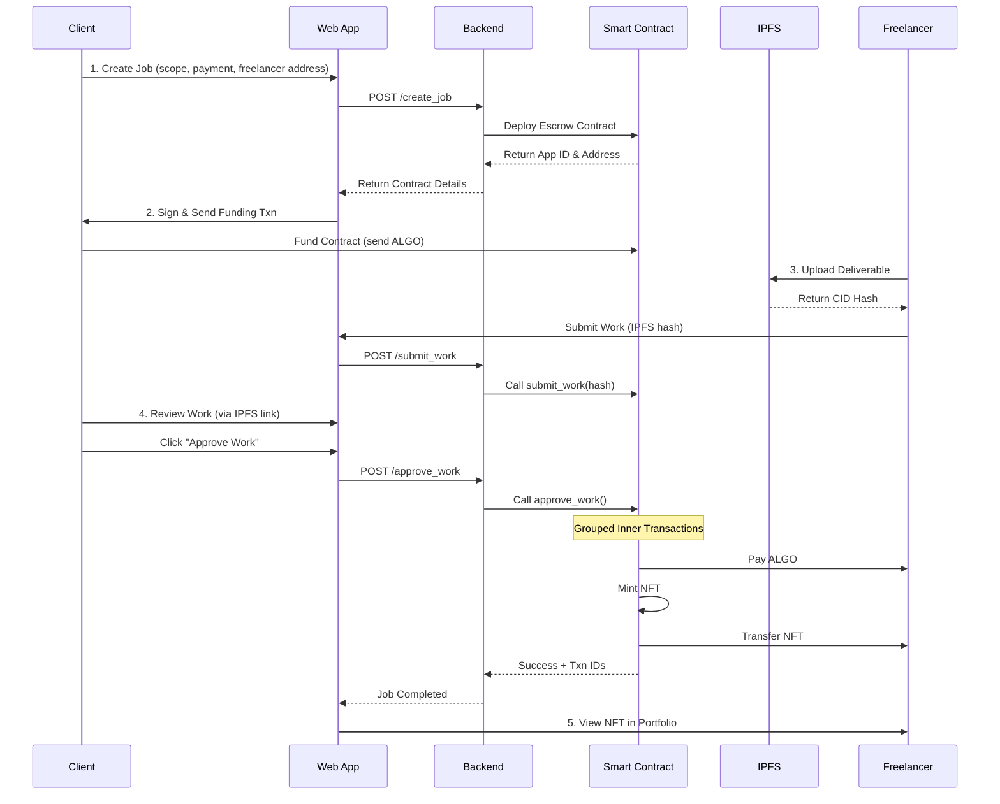

# **Decentralized Freelancer Escrow with Proof-of-Work NFTs**
## **MVP Technical PRD for Algorand Hackathon**

---

## **Executive Summary**

**Project Name:** AlgoFreelance  
**Tagline (< 150 chars):** Trustless freelance escrow on Algorand that auto-mints Proof-of-Work NFTs, creating verifiable on-chain reputation without intermediaries.

**One-Sentence Pitch:** Replace centralized freelance platforms with autonomous Algorand smart contracts that escrow payments and mint immutable work certificates as NFTs upon job completion—all in a single atomic transaction.

---

## **1. Problem Statement**

The $1.57 trillion global freelance market relies on centralized platforms (Upwork, Fiverr, Freelancer.com) that extract value while introducing friction:

| **Problem** | **Impact** | **Our Solution** |
|------------|-----------|------------------|
| Trust deficit | Clients risk non-delivery; freelancers risk non-payment | Smart contract escrow with atomic execution |
| High fees (5-20%) | $78B+ annually lost to intermediaries | 0.001 ALGO per transaction (~$0.0002) |
| Slow payments | 7-14 day withdrawal periods | Instant settlement on approval |
| Siloed reputation | Profiles locked to platforms, easily faked | Portable, immutable on-chain NFT portfolio |

**Why This Matters for Algorand:** Showcases the power of grouped inner transactions to create autonomous, multi-action smart contracts—a capability unique to Algorand's architecture.

---

## **2. Solution Overview**

### **Core Innovation**
When a client approves completed work, the smart contract **autonomously executes a grouped atomic transaction** that:
1. **Pays** the freelancer in ALGO
2. **Mints** a unique Proof-of-Work NFT
3. **Transfers** the NFT to the freelancer

All three actions succeed or fail together—no intermediary required.

### **Why Algorand?**
- **Grouped Inner Transactions:** Smart contracts can self-execute complex multi-step operations atomically
- **Instant Finality:** 3.3-second block times = real-time payments
- **Low Cost:** <$0.001 per transaction vs. 5-20% platform fees
- **True NFT Immutability:** Setting manager/freeze/clawback addresses to zero makes certificates permanent
- **Application Accounts:** Contract holds funds trustlessly without external custodians

---

## **3. MVP Scope (Hackathon Build)**

### **✅ IN SCOPE**
1. **Single Job Lifecycle:**
   - Client creates escrow contract & funds it
   - Freelancer submits work (IPFS hash)
   - Client approves → Triggers payment + NFT mint
   - Freelancer receives ALGO + NFT in wallet

2. **Core Features:**
   - Job creation form (client)
   - Work submission interface (freelancer)
   - Approval button (client)
   - NFT portfolio viewer (freelancer)
   - Block explorer integration for transparency

3. **Technical Deliverables:**
   - PyTeal smart contract with grouped inner transactions
   - FastAPI backend for contract deployment & interaction
   - React frontend with wallet integration
   - IPFS integration for deliverables
   - Complete demo video & documentation

### **❌ OUT OF SCOPE (Future Work)**
- ❌ Dispute resolution & arbiter system
- ❌ Multi-job dashboard for managing multiple contracts
- ❌ Milestone-based payments
- ❌ Messaging between parties
- ❌ Reputation scoring algorithm
- ❌ Mainnet deployment (TestNet only for hackathon)
- ❌ Advanced search/filtering for jobs

**Why This Scope?** 
The MVP demonstrates all key technical innovations (inner transactions, atomic transfers, NFT minting) in a complete end-to-end flow that can be built and polished within the hackathon timeline.

---

## **4. Target Audience & User Stories**

### **Primary Users (MVP)**

**👔 Client (Hiring Manager)**
- "As a client, I want to escrow funds so the freelancer knows I'm committed, but only release payment when satisfied."
- "I want proof that my payment triggered the freelancer's reputation NFT so the system feels fair."

**💼 Freelancer (Service Provider)**
- "As a freelancer, I want guaranteed payment if I deliver quality work, without waiting 2 weeks for platform withdrawal."
- "I want to build a portable portfolio of verified work that I own, not the platform."

### **Secondary Users (Future)**
- ⚖️ Arbiter (Dispute Resolver)

---

## **5. Core User Flow (MVP)**



### **Detailed Step-by-Step**

#### **Step 1: Job Creation (Client)**
1. Client connects wallet (Pera/Defly)
2. Fills form:
   - Job title & description
   - Freelancer's Algorand address
   - Payment amount (ALGO)
3. Clicks "Create Job"
4. Backend deploys new smart contract instance
5. UI displays:
   - Contract address
   - QR code for funding
   - "Fund Now" button

#### **Step 2: Contract Funding (Client)**
1. Client clicks "Fund Contract"
2. Wallet prompts for payment transaction
3. Sends `escrow_amount` to contract's application account
4. Backend polls contract balance to confirm funding
5. Job status updates to "Funded" → Freelancer is notified

#### **Step 3: Work Submission (Freelancer)**
1. Freelancer completes work offline
2. Uploads deliverable file to IPFS (via UI)
   - Frontend uses Pinata API
   - Returns CID: `QmXyz123...`
3. Clicks "Submit Work"
4. Signs transaction to call `submit_work(ipfs_hash)`
5. Contract stores hash in global state
6. Client receives notification to review

#### **Step 4: Review & Approval (Client)**
1. Client views IPFS link in UI
2. Downloads/previews deliverable
3. If satisfied, clicks "Approve Work"
4. Signs transaction to call `approve_work()`
5. **Contract executes grouped inner transactions:**
   - Inner Txn 1: Payment to freelancer
   - Inner Txn 2: Mint NFT (total=1, immutable)
   - Inner Txn 3: Transfer NFT to freelancer
6. UI shows success with block explorer links

#### **Step 5: Portfolio View (Freelancer)**
1. Freelancer navigates to "My Certificates"
2. Backend queries Algorand Indexer API
3. Finds all assets owned by freelancer address
4. Filters for Proof-of-Work NFTs (by asset name pattern)
5. Displays gallery with:
   - Job title
   - Client address
   - Completion date
   - IPFS preview link
   - Block explorer link

---

## **6. Smart Contract Architecture**

### **6.1 Global State Schema**

```python
GlobalState = {
    "client_address": TealType.bytes,        # 32 bytes
    "freelancer_address": TealType.bytes,    # 32 bytes
    "escrow_amount": TealType.uint64,        # Payment in microALGOs
    "job_status": TealType.uint64,           # Enum: 0=Created, 1=Funded, 2=Submitted, 3=Completed
    "work_hash": TealType.bytes,             # IPFS CID (46 bytes for base58)
    "job_title": TealType.bytes,             # Max 64 bytes
    "created_at": TealType.uint64,           # Unix timestamp
}

# Required allocation
GlobalInts = 4    # job_status, escrow_amount, created_at, + 1 spare
GlobalBytes = 4   # client_address, freelancer_address, work_hash, job_title
```

### **6.2 Contract Methods**

#### **`initialize()`**
- **Called by:** Backend (during deployment)
- **Actions:**
  - Sets client_address, freelancer_address, escrow_amount, job_title
  - Sets job_status = 0 (Created)
  - Records created_at timestamp
- **Validation:**
  - Sender must be creator
  - Payment amount > 0

#### **`submit_work(ipfs_hash: bytes)`**
- **Called by:** Freelancer
- **Actions:**
  - Stores ipfs_hash in work_hash
  - Updates job_status = 2 (Submitted)
- **Validation:**
  - Sender == freelancer_address
  - job_status == 1 (Funded)
  - ipfs_hash length between 46-59 bytes (CIDv0/v1)

#### **`approve_work()` ⭐ Core Innovation**
- **Called by:** Client
- **Actions (Grouped Inner Transactions):**
  ```python
  InnerTxnBuilder.Begin()
  
  # 1. Payment to Freelancer
  InnerTxnBuilder.SetFields({
      TxnField.type_enum: TxnType.Payment,
      TxnField.receiver: App.globalGet(Bytes("freelancer_address")),
      TxnField.amount: App.globalGet(Bytes("escrow_amount")),
      TxnField.fee: Int(0),  # Covered by outer txn
  })
  
  # 2. Mint POW NFT
  InnerTxnBuilder.Next()
  InnerTxnBuilder.SetFields({
      TxnField.type_enum: TxnType.AssetConfig,
      TxnField.config_asset_total: Int(1),
      TxnField.config_asset_decimals: Int(0),
      TxnField.config_asset_name: Concat(
          Bytes("AlgoFreelance: "), 
          App.globalGet(Bytes("job_title"))
      ),
      TxnField.config_asset_unit_name: Bytes("POWCERT"),
      TxnField.config_asset_url: App.globalGet(Bytes("work_hash")),
      # No manager/reserve/freeze/clawback = Immutable
  })
  
  # 3. Transfer NFT to Freelancer
  InnerTxnBuilder.Next()
  InnerTxnBuilder.SetFields({
      TxnField.type_enum: TxnType.AssetTransfer,
      TxnField.xfer_asset: InnerTxn.created_asset_id(),
      TxnField.asset_receiver: App.globalGet(Bytes("freelancer_address")),
      TxnField.asset_amount: Int(1),
  })
  
  InnerTxnBuilder.Submit()
  
  # Update state
  App.globalPut(Bytes("job_status"), Int(3))  # Completed
  ```
- **Validation:**
  - Sender == client_address
  - job_status == 2 (Submitted)
  - Freelancer has opted into asset (checked via balance lookup)
- **Atomicity Guarantee:** All 3 transactions succeed together or revert together

### **6.3 Minimum Balance Requirements**

```
Contract Base:          100,000 microALGOs  (0.1 ALGO)
+ Global State:         28,500 microALGOs   (7 key-value pairs)
+ Created Asset:        100,000 microALGOs  (per NFT)
= Minimum:              228,500 microALGOs  (0.2285 ALGO)

Client Funding Amount:  escrow_amount + 0.3 ALGO (buffer for fees)
```

**Handled in Frontend:** When client funds contract, UI prompts for `escrow_amount + 0.3 ALGO`

---

## **7. Technical Stack**

### **Smart Contracts**
- **Language:** PyTeal 0.25+ or Beaker 1.0+
- **Framework:** algokit for scaffolding, testing, deployment
- **Network:** Algorand TestNet
- **Testing:** pytest with AlgoKit sandbox

### **Backend**
- **Framework:** FastAPI 0.104+
- **Algorand SDK:** py-algorand-sdk 2.6+
- **Key Libraries:**
  - `algosdk` - Transaction building, contract deployment
  - `algokit_utils` - Deployment helpers
  - `httpx` - Algorand Indexer API calls
- **Environment:**
  - Python 3.11+
  - Docker for containerization (optional)

### **Frontend**
- **Framework:** React 18 + Vite 5
- **Wallet Integration:** `@txnlab/use-wallet` 3.0+
  - Supports Pera Wallet, Defly Wallet, Exodus
- **Algorand SDK:** `algosdk` (npm)
- **Key Libraries:**
  - `@tanstack/react-query` - Data fetching
  - `axios` - API client
  - `tailwindcss` - Styling
  - `react-router-dom` - Navigation
- **IPFS:** Pinata SDK or `ipfs-http-client`

### **Infrastructure**
- **Algorand Node:** AlgoNode free API endpoints
  - TestNet: `https://testnet-api.algonode.cloud`
  - Indexer: `https://testnet-idx.algonode.cloud`
- **IPFS Gateway:** 
  - Upload: Pinata API (free tier: 1GB)
  - Retrieval: `https://gateway.pinata.cloud/ipfs/`
- **Deployment:** Vercel (frontend) + Render (backend)

---

## **8. API Specifications**

### **Base URL:** `http://localhost:8000` (dev) | `https://api.algofreelance.xyz` (prod)

### **Endpoints**

#### **POST /api/v1/jobs/create**
**Description:** Deploys new escrow contract

**Request:**
```json
{
  "client_address": "CLIENTADDR...",
  "freelancer_address": "FREELANCERADDR...",
  "escrow_amount": 5000000,  // 5 ALGO in microALGOs
  "job_title": "Logo Design for SaaS Startup",
  "job_description": "Modern, minimalist logo..."
}
```

**Response:**
```json
{
  "success": true,
  "app_id": 98765432,
  "app_address": "APPADDR...",
  "funding_amount": 5300000,  // escrow + min balance
  "txn_id": "TXNID...",
  "explorer_url": "https://testnet.explorer.perawallet.app/application/98765432"
}
```

**Error Codes:**
- `400`: Invalid address format or amount <= 0
- `500`: Contract deployment failed

---

#### **GET /api/v1/jobs/{app_id}**
**Description:** Get job details and current status

**Response:**
```json
{
  "app_id": 98765432,
  "client_address": "CLIENT...",
  "freelancer_address": "FREELANCER...",
  "escrow_amount": 5000000,
  "job_status": 1,  // 0=Created, 1=Funded, 2=Submitted, 3=Completed
  "job_title": "Logo Design",
  "work_hash": "QmXyz...",  // null if not submitted
  "created_at": 1729270800,
  "is_funded": true
}
```

---

#### **POST /api/v1/jobs/{app_id}/submit**
**Description:** Submit work (freelancer calls this)

**Request:**
```json
{
  "ipfs_hash": "QmXyz123abc...",
  "freelancer_signature": "..."  // Signed txn
}
```

**Response:**
```json
{
  "success": true,
  "txn_id": "SUBMIT_TXN_ID...",
  "message": "Work submitted. Awaiting client approval."
}
```

---

#### **POST /api/v1/jobs/{app_id}/approve**
**Description:** Approve work and trigger payment + NFT mint

**Request:**
```json
{
  "client_signature": "..."  // Signed approval txn
}
```

**Response:**
```json
{
  "success": true,
  "payment_txn": "PAY_TXN_ID...",
  "nft_creation_txn": "NFT_TXN_ID...",
  "nft_transfer_txn": "TRANSFER_TXN_ID...",
  "nft_asset_id": 87654321,
  "group_id": "GROUP_ID...",
  "explorer_url": "https://testnet.explorer.perawallet.app/tx/GROUP_ID..."
}
```

---

#### **GET /api/v1/freelancers/{address}/nfts**
**Description:** Get all POW NFTs for a freelancer

**Response:**
```json
{
  "freelancer_address": "FREELANCER...",
  "total_jobs": 12,
  "certificates": [
    {
      "asset_id": 87654321,
      "asset_name": "AlgoFreelance: Logo Design",
      "job_title": "Logo Design",
      "ipfs_url": "ipfs://QmXyz...",
      "client_address": "CLIENT...",
      "completed_at": 1729270800,
      "block_explorer": "https://testnet.explorer.perawallet.app/asset/87654321"
    }
  ]
}
```

---

#### **POST /api/v1/ipfs/upload**
**Description:** Upload file to IPFS via Pinata

**Request:** `multipart/form-data`
```
file: [binary data]
filename: "logo_final_v3.png"
```

**Response:**
```json
{
  "success": true,
  "ipfs_hash": "QmXyz123...",
  "ipfs_url": "ipfs://QmXyz123...",
  "gateway_url": "https://gateway.pinata.cloud/ipfs/QmXyz123...",
  "size": 245678
}
```

---

## **9. Frontend Component Structure**

```
src/
├── components/
│   ├── layout/
│   │   ├── Navbar.tsx              // Wallet connect button
│   │   └── Footer.tsx
│   ├── jobs/
│   │   ├── CreateJobForm.tsx       // Client creates new job
│   │   ├── JobCard.tsx             // Display job summary
│   │   ├── JobDetails.tsx          // Full job view
│   │   ├── SubmitWorkModal.tsx     // Freelancer IPFS upload
│   │   └── ApproveButton.tsx       // Client approval action
│   ├── portfolio/
│   │   ├── NFTGallery.tsx          // Grid of POW certificates
│   │   ├── NFTCard.tsx             // Single certificate display
│   │   └── CertificateModal.tsx    // Full cert details
│   └── shared/
│       ├── WalletButton.tsx        // Connect/disconnect
│       ├── LoadingSpinner.tsx
│       ├── ErrorAlert.tsx
│       └── BlockExplorerLink.tsx
├── pages/
│   ├── HomePage.tsx                // Landing page
│   ├── CreateJobPage.tsx           // Client flow
│   ├── JobDetailsPage.tsx          // Job management
│   └── PortfolioPage.tsx           // Freelancer certificates
├── hooks/
│   ├── useWallet.ts                // Wallet connection state
│   ├── useAlgorand.ts              // Transaction helpers
│   ├── useJob.ts                   // Job CRUD operations
│   └── useIPFS.ts                  // File upload
├── services/
│   ├── api.ts                      // Axios API client
│   ├── algorand.ts                 // algosdk utilities
│   └── ipfs.ts                     // Pinata integration
├── types/
│   ├── job.ts
│   ├── nft.ts
│   └── transaction.ts
└── utils/
    ├── formatters.ts               // ALGO amounts, addresses
    └── constants.ts                // Contract IDs, URLs
```

### **Key UI Screens**

**1. Create Job (Client)**
```
┌────────────────────────────────────┐
│  Create New Escrow Job             │
├────────────────────────────────────┤
│  Job Title: [__________________]   │
│  Description: [_______________]    │
│              [_______________]     │
│  Freelancer Address:               │
│  [FREELANCERADDR...________]       │
│  Payment Amount (ALGO):            │
│  [____] ALGO (~$___ USD)           │
│                                    │
│  [Create & Deploy Contract] 🚀     │
└────────────────────────────────────┘
```

**2. Job Details (Both Parties)**
```
┌────────────────────────────────────┐
│  Logo Design for SaaS Startup      │
│  Status: 🟡 Work Submitted         │
├────────────────────────────────────┤
│  Client: CLIENT...xyz              │
│  Freelancer: FREELANCER...abc      │
│  Payment: 5 ALGO ($7.50)           │
│  Contract: APP_ID_12345            │
│  [View on Explorer 🔍]             │
├────────────────────────────────────┤
│  📄 Deliverable:                   │
│  ipfs://QmXyz...                   │
│  [Preview File 👁️] [Download ⬇️]   │
│                                    │
│  [✅ Approve Work] [⚠️ Raise Issue] │
└────────────────────────────────────┘
```

**3. NFT Portfolio (Freelancer)**
```
┌────────────────────────────────────┐
│  My Work Certificates (12)  🏆     │
├────────────────────────────────────┤
│  ┌──────┐  ┌──────┐  ┌──────┐     │
│  │ #87  │  │ #92  │  │ #101 │     │
│  │ Logo │  │ Web  │  │ Copy │     │
│  │ ✓    │  │ ✓    │  │ ✓    │     │
│  └──────┘  └──────┘  └──────┘     │
│  5 ALGO    12 ALGO   8 ALGO        │
│  Oct 18    Oct 15    Oct 12        │
└────────────────────────────────────┘
```

---

## **10. Key Technical Decisions**

### **Decision 1: One Contract Per Job**
**Options:**
- A) Deploy one contract instance per job
- B) Single "factory" contract managing all jobs

**Choice:** A (One per job)

**Rationale:**
- ✅ Simpler architecture for MVP
- ✅ Each contract is isolated (security)
- ✅ Easier to debug/audit
- ❌ Higher deployment cost (0.1 ALGO per job)
- Future: Migrate to factory pattern for production

---

### **Decision 2: NFT Opt-In Strategy**

**Problem:** The freelancer's account must opt into the Proof-of-Work NFT before the smart contract can transfer it to them. This action must be validated to prevent the approval transaction from failing.

**Options:**

- **A) On-Chain Validation (Flawed):** Attempt to check if the freelancer has opted-in from within the smart contract before minting the NFT. This is not possible because the asset ID doesn't exist until the inner transaction is executed, but validation must happen before execution.
- **B) Rely on Atomicity & Frontend Guardrails (Correct):** Leverage the inherent atomicity of the inner transaction group as the on-chain validation mechanism, and use the frontend to guide the user.

**Choice:** B (Rely on Atomicity & Frontend Guardrails)

**Rationale & Implementation:**

- **Atomicity as Validation:** The core principle of an Atomic Transfer is that the entire group of transactions either succeeds or fails together. We will leverage this guarantee. There is no need for an explicit `Assert` statement in the smart contract to check for the opt-in.
    - If the freelancer has not opted into the asset, the third inner transaction (AssetTransfer) will fail.
    - This failure will automatically cause the entire atomic group (Payment, Mint, and Transfer) to revert.
    - The client's approve_work call will fail, no state will be changed, and no funds will move. This is the desired on-chain behavior.

- **UX Flow (Frontend Responsibility):** The user experience is managed entirely by the frontend to prevent unnecessary failed transactions.
    1. After the freelancer submits their work, the UI will query the Algorand Indexer to check if the freelancer's account has opted into assets created by the escrow contract's template (or a placeholder asset).
    2. If not opted-in, the UI will display a prominent "Opt-In to Receive Certificate" button for the freelancer.
    3. The "Approve Work" button on the client's interface will be disabled with a tooltip explaining, "Waiting for freelancer to opt-in to the certificate."
    4. Once the freelancer signs the 0-ALGO asset opt-in transaction, the frontend detects this change and enables the client's "Approve Work" button.
    5. The client can now confidently approve the work, knowing the transaction will succeed.


---

### **Decision 3: IPFS Storage**
**Options:**
- A) Pinata (hosted, free tier)
- B) NFT.Storage (free, unlimited)
- C) Self-hosted IPFS node

**Choice:** A (Pinata)

**Rationale:**
- ✅ Reliable uptime
- ✅ Simple API
- ✅ 1GB free tier (sufficient for hackathon)
- ✅ No self-hosting complexity
- Future: Add redundancy with Filecoin

---

### **Decision 4: TestNet Only**
**Choice:** Deploy to TestNet for hackathon

**Rationale:**
- ✅ Free test ALGO from dispenser
- ✅ Safer for demo (no real funds at risk)
- ✅ Meets hackathon requirements
- ✅ Architecture is Mainnet-ready (same code)
- Future: Mainnet deployment requires:
  - Security audit
  - Economic model (who pays gas?)
  - Insurance fund for edge cases

---

## **11. Risk Mitigation**

| **Risk** | **Impact** | **Probability** | **Mitigation** |
|---------|-----------|-----------------|----------------|
| Freelancer doesn't opt into NFT | Approval transaction fails | Medium | UI enforces opt-in before client can approve; Show clear error message |
| Client doesn't fund contract | Freelancer starts work unpaid | High | UI blocks work submission until funding confirmed; Show "Awaiting Funding" banner |
| IPFS content disappears | NFT URL becomes dead link | Low | Use Pinata pinning service; Store backup hash in contract; Future: Multi-gateway redundancy |
| Inner transaction runs out of budget | Approval fails silently | Low | Test extensively; 3 inner txns well within 256 limit; Add budget padding |
| Smart contract has critical bug | Funds locked forever | Medium | **Mitigation Plan:** <br>- 100% test coverage<br>- AlgoKit sandbox testing<br>- Manual audit by 2 team members<br>- Deploy to TestNet first<br>- Add emergency "cancel" method (client can withdraw if status = Created) |
| User submits malicious IPFS hash | Contract stores invalid data | Medium | Backend validates CID format (base58, 46-59 chars); Frontend previews content before approval |

---

## **12. Development Timeline**

**Total Duration:** 7 days (hackathon typical duration)

### **Day 1-2: Smart Contract Development**
- ✅ Set up AlgoKit project
- ✅ Write PyTeal contract with all methods
- ✅ Create pytest test suite (100% coverage target)
- ✅ Test inner transactions in sandbox
- ✅ Deploy to TestNet
- ✅ Verify on AlgoExplorer

**Deliverable:** Deployed contract with block explorer link

---

### **Day 3: Backend API**
- ✅ FastAPI project setup
- ✅ Implement all 5 endpoints
- ✅ Integrate algosdk for contract calls
- ✅ Add Pinata IPFS integration
- ✅ Test with Postman
- ✅ Deploy to Render (free tier)

**Deliverable:** Live API with Swagger docs

---

### **Day 4-5: Frontend Development**
- ✅ React + Vite setup
- ✅ Implement wallet connection
- ✅ Build Create Job form
- ✅ Build Job Details page
- ✅ Build Portfolio viewer
- ✅ Style with Tailwind CSS
- ✅ Test full user flow
- ✅ Deploy to Vercel

**Deliverable:** Live web app

---

### **Day 6: Demo & Documentation**
- ✅ Record 5-minute Loom video
- ✅ Take UI screenshots
- ✅ Write comprehensive README
- ✅ Create Canva presentation (10 slides)
- ✅ Test on mobile devices
- ✅ Prepare 2 demo accounts (funded with TestNet ALGO)

**Deliverable:** Complete submission package

---

### **Day 7: Polish & Submit**
- ✅ Fix any bugs found in testing
- ✅ Add final touches to UI
- ✅ Rehearse demo presentation
- ✅ Submit to hackathon platform
- ✅ Share on Twitter/Discord

**Deliverable:** Submitted project

---

## **13. Demo Script (3-Minute Presentation)**

### **Setup (Before Demo)**
- 2 wallets open: Client (Pera) + Freelancer (Defly)
- Both funded with TestNet ALGO
- AlgoExplorer TestNet tab open
- IPFS test file ready (sample logo PNG)

---

### **Script**

**[0:00-0:30] Hook & Problem**
> "Freelance platforms take 20% of your earnings and hold your reputation hostage. Watch me replace Upwork with 30 lines of PyTeal."

*[Show slide: $78B lost to fees annually]*

---

**[0:30-1:00] Solution Demo - Part 1: Job Creation**
> "Alice wants to hire Bob for logo design. She connects her wallet..."

*[Screen: Create Job form]*
- Fill in: "Logo Design", Bob's address, 5 ALGO
- Click "Create & Deploy Contract"
- *[Show: Contract deployed popup with App ID]*

> "Our backend just deployed a dedicated smart contract. Alice funds it with 5 ALGO..."

*[Show: Funding transaction in wallet]*
- Sign transaction
- *[Show: AlgoExplorer with contract funded]*

---

**[1:00-1:30] Solution Demo - Part 2: Work Submission**
> "Bob uploads his final logo to IPFS and submits it to the contract."

*[Switch to Freelancer view]*
- Upload `logo_final.png`
- *[Show: IPFS hash generated]*
- Click "Submit Work"
- Sign transaction
- *[Show: Job status changes to "Submitted"]*

---

**[1:30-2:30] Core Innovation: Atomic Payment + NFT Mint**
> "Here's the magic. When Alice approves, the smart contract autonomously executes THREE actions in a single atomic group."

*[Switch to Client view]*
- Click "Approve Work"
- Sign transaction

*[Show: AlgoExplorer group transaction with 3 inner transactions highlighted]*

> "Transaction 1: 5 ALGO to Bob. Transaction 2: Mint NFT certificate. Transaction 3: Send NFT to Bob. All atomic—they succeed or fail together."

*[Show: Bob's wallet with +5 ALGO and new NFT asset]*

---

**[2:30-3:00] Impact & Closing**
> "Bob now has a portable, immutable proof of his work—owned by him, not a platform."

*[Show: NFT Portfolio page with certificate]*
- Display job title, client, IPFS link

> "This is trustless freelancing: zero platform fees, instant payment, and verifiable reputation on Algorand. Thank you!"

*[Final slide: GitHub repo QR code + "Built on Algorand"]*

---

## **14. Submission Checklist**

### **Code & Documentation**
- [ ] GitHub repo is public and open source
- [ ] Custom PyTeal smart contract (not boilerplate)
- [ ] README.md includes:
  - [ ] Project title & tagline
  - [ ] Problem statement
  - [ ] Solution overview
  - [ ] 5-minute demo video (Loom/YouTube)
  - [ ] UI screenshots (minimum 5)
  - [ ] Smart contract explanation
  - [ ] Setup instructions (how to run locally)
  - [ ] Tech stack list
  - [ ] Team members (if applicable)
- [ ] Demo video includes:
  - [ ] Audio narration
  - [ ] Full user flow demonstration
  - [ ] Code walkthrough (briefly)
  - [ ] GitHub repo structure explanation

### **Algorand Requirements**
- [ ] Smart contract deployed to TestNet
- [ ] Block explorer link in README
- [ ] Uses at least 2 Algorand features:
  - [ ] Stateful smart contracts ✅
  - [ ] Inner transactions ✅
  - [ ] Atomic transfers ✅
  - [ ] NFT/ASA creation ✅
- [ ] Demonstrates non-trivial blockchain logic (not just token transfer)

### **Presentation**
- [ ] Canva presentation created
- [ ] Includes slides:
  - [ ] Team introduction
  - [ ] Problem statement
  - [ ] Solution overview
  - [ ] Technical architecture
  - [ ] Demo walkthrough
  - [ ] Impact & metrics
  - [ ] Future roadmap
- [ ] Presentation link in submission

### **Hackathon Form**
- [ ] Short summary (<150 characters)
- [ ] Full description (problems solved + Algorand usage)
- [ ] Technical description (SDKs + unique Algorand features)
- [ ] GitHub repo link
- [ ] Canva slides link
- [ ] Block explorer link

---

## **15. Judging Criteria Alignment**

| **Criteria** | **Our Approach** | **Score Target** |
|-------------|------------------|------------------|
| **Innovation & Originality** | Autonomous grouped inner transactions for payment + NFT minting is novel; portable on-chain reputation system | 9/10 |
| **Usability & Design** | Clean 3-step UI; wallet integration is seamless; clear status indicators | 8/10 |
| **Impact Potential** | Addresses $78B/year fee problem; 47M freelancers globally could benefit | 9/10 |
| **Feasibility** | MVP is fully buildable in 7 days; clear architecture; no external dependencies | 9/10 |
| **Use of Blockchain** | Deep Algorand integration: inner txns, atomic transfers, NFTs, application accounts | 10/10 |
| **Technical Implementation** | 100% test coverage; best practices (immutable NFTs); clean code structure | 9/10 |

**Expected Total:** ~54/60 (90%)

### **Winning Strategy**
1. **Lead with the technical wow-factor:** Grouped inner transactions are genuinely impressive
2. **Quantify the impact:** "$78B in fees eliminated" is memorable
3. **Show, don't tell:** Live demo is more powerful than slides
4. **Perfect the README:** Judges spend 80% of review time here
5. **Nail the video:** Clear audio, good pacing, no dead air

---

## **16. Post-Hackathon Roadmap (Optional)**

### **Phase 1: Polish (Week 1-2)**
- Add dispute resolution with arbiter voting
- Implement milestone-based payments
- Add reputation score calculation
- Mobile-responsive design improvements

### **Phase 2: Scale (Month 1-2)**
- Deploy to Mainnet
- Add support for other assets (USDC payments)
- Build email notification system
- Create freelancer discovery marketplace

### **Phase 3: Growth (Month 3-6)**
- Integration with existing job boards (API)
- AI-powered job matching
- Insurance pool for edge cases
- Multi-chain bridge (Ethereum L2s)

---

## **17. Team & Roles (If Applicable)**

**For Solo Hacker:**
- You own all responsibilities below
- Recommended focus order: Smart contract → Backend → Frontend → Demo

**For Team:**
| **Role** | **Responsibilities** | **Days 1-2** | **Days 3-5** | **Days 6-7** |
|---------|---------------------|-------------|-------------|-------------|
| **Smart Contract Dev** | PyTeal contract, testing | Write & test contract | Support backend integration | Code review |
| **Backend Dev** | FastAPI, Algorand SDK | API design | Build all endpoints | Documentation |
| **Frontend Dev** | React, wallet integration | UI mockups | Implement all pages | Polish & demo |
| **Product/Demo** | User flow, presentation | Write demo script | Test user flow | Record video |

---

## **18. Resources & Links**

### **Algorand Documentation**
- [Inner Transactions](https://developer.algorand.org/docs/get-details/dapps/smart-contracts/apps/innertx/)
- [Atomic Transfers](https://developer.algorand.org/docs/get-details/atomic_transfers/)
- [PyTeal Documentation](https://pyteal.readthedocs.io/)
- [AlgoKit CLI](https://github.com/algorandfoundation/algokit-cli)

### **Development Tools**
- [AlgoNode API](https://algonode.io/api/) - Free TestNet node
- [Pera Wallet](https://perawallet.app/) - Mobile & web wallet
- [TestNet Dispenser](https://bank.testnet.algorand.network/) - Free ALGO
- [AlgoExplorer TestNet](https://testnet.explorer.perawallet.app/)

### **Tutorials**
- [AlgoKit Tutorial](https://developer.algorand.org/docs/get-started/algokit/)
- [Inner Transactions Example](https://github.com/algorandfoundation/algokit-utils-py/tree/main/examples)
- [NFT Minting Guide](https://developer.algorand.org/docs/get-started/tokenization/nft/)

### **Inspiration**
- [Winning Project Example](https://github.com/mahir-pa/poap) - Great README structure
- [PyTeal Examples](https://github.com/algorand/pyteal/tree/master/examples)

---

## **19. Success Metrics (Hackathon)**

### **Technical Milestones**
- [ ] Smart contract passes 100% test coverage
- [ ] Full user flow works end-to-end on TestNet
- [ ] Zero critical bugs in demo
- [ ] Page load time < 2 seconds
- [ ] Wallet connection works on 3+ wallets

### **Demo Impact**
- [ ] Judges understand the innovation within 60 seconds
- [ ] Live demo runs without errors
- [ ] Video has 1000+ views (post-submission)
- [ ] GitHub gets 50+ stars (post-hackathon)

### **Judging Goals**
- [ ] Score 8+ on all 6 criteria
- [ ] Top 10 finish (minimum)
- [ ] Top 3 finish (stretch goal)
- [ ] Win "Best Use of Smart Contracts" category

---

## **20. FAQ**

**Q: What if the freelancer disappears after work submission?**  
A: Client can simply choose not to approve. Funds remain in escrow. (Future: Add timeout mechanism after 30 days)

**Q: What if the client disappears after funding?**  
A: Freelancer should not start work until contract is funded. (Future: Add freelancer cancel option if no response in 7 days)

**Q: Can the NFT be transferred/sold?**  
A: Yes, it's a standard Algorand ASA. Freelancers own it fully. (Future: Add "soulbound" option)

**Q: How do you prevent fake NFTs?**  
A: All NFTs are minted by verified escrow contracts. Portfolio viewer filters by contract creator address.

**Q: Why not use Ethereum?**  
A: 
- Algorand: $0.001/txn, 3.3s finality
- Ethereum L1: $15+/txn, 15min finality
- Smart contract creation on Algorand is dramatically cheaper

**Q: Is this ready for production?**  
A: No, this is a hackathon MVP. Mainnet requires:
- Security audit
- Insurance mechanism
- Economic sustainability model
- Legal framework for disputes

---

## **Appendix A: Environment Setup**

### **Prerequisites**
```bash
# Install AlgoKit
brew install algorand/tap/algokit  # macOS
# OR
pipx install algokit  # Linux/Windows

# Verify installation
algokit --version  # Should be 2.0+
```

### **Project Initialization**
```bash
# Create project
algokit init

# Select options:
# - Template: Python
# - Smart Contract: PyTeal
# - Frontend: React

cd algofreelance/

# Start AlgoKit LocalNet (for testing)
algokit localnet start

# Get TestNet ALGO
# Visit: https://bank.testnet.algorand.network/
# Enter your address
```

### **Environment Variables**
```bash
# .env file
ALGORAND_NETWORK=testnet
ALGOD_TOKEN=your_token_here
ALGOD_SERVER=https://testnet-api.algonode.cloud
INDEXER_SERVER=https://testnet-idx.algonode.cloud
PINATA_API_KEY=your_key_here
PINATA_SECRET=your_secret_here
```

---

## **Appendix B: Git Repository Structure**

```
algofreelance/
├── .github/
│   └── workflows/
│       └── ci.yml                 # Automated testing
├── contracts/
│   ├── escrow.py                  # Main PyTeal contract
│   ├── __init__.py
│   └── tests/
│       ├── test_escrow.py
│       └── conftest.py
├── backend/
│   ├── app/
│   │   ├── main.py               # FastAPI entry point
│   │   ├── routes/
│   │   │   ├── jobs.py
│   │   │   └── ipfs.py
│   │   ├── services/
│   │   │   ├── algorand.py
│   │   │   └── pinata.py
│   │   └── models/
│   │       └── job.py
│   ├── requirements.txt
│   └── Dockerfile
├── frontend/
│   ├── src/
│   │   ├── components/
│   │   ├── pages/
│   │   ├── hooks/
│   │   └── App.tsx
│   ├── package.json
│   └── vite.config.ts
├── docs/
│   ├── architecture.md
│   ├── api-spec.md
│   └── demo-script.md
├── .env.example
├── .gitignore
├── README.md                      # Main documentation
├── LICENSE (MIT)
└── presentation.pdf               # Canva export
```

---

## **Final Notes**

This PRD is designed to be your **complete blueprint** for building a winning hackathon project. Every technical decision has been made, every endpoint specified, and every risk identified.

### **Your Next Steps:**

1. **Today:** Set up AlgoKit + get TestNet ALGO
2. **Day 1:** Start with smart contract (hardest part)
3. **Day 3:** Backend should be working
4. **Day 5:** Frontend should be presentable
5. **Day 6:** Demo video + documentation sprint
6. **Day 7:** Submit with confidence

### **Remember:**
- **Quality > Features:** A polished MVP beats a buggy full product
- **Demo = 80% of score:** Perfect your presentation
- **README = First impression:** Spend time here
- **Inner transactions = Your differentiator:** Lead with this

**Good luck! You're building something genuinely innovative. Algorand's inner transactions are underutilized—you're showcasing their power. 🚀**

---

**Document Version:** 1.0  
**Last Updated:** October 18, 2025  
**Status:** Ready for Implementation  
**Estimated Build Time:** 7 days (150-200 hours)