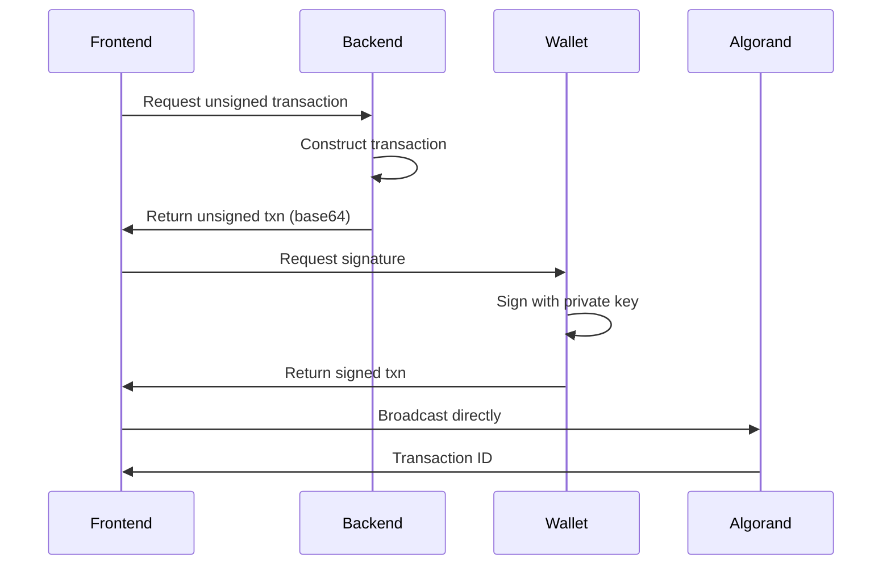

# AlgoFreelance Backend API

FastAPI backend service for the AlgoFreelance decentralized freelance escrow platform on Algorand.

## Features

- ✅ Smart contract deployment and management
- ✅ Transaction construction for wallet signing (secure dApp pattern)
- ✅ IPFS integration via Pinata
- ✅ NFT portfolio retrieval via Indexer
- ✅ Complete job lifecycle support
- ✅ Multi-environment (LocalNet/TestNet)

## Architecture

The backend follows the secure dApp pattern:
1. **Backend constructs** unsigned transactions
2. **Frontend wallet signs** transactions (keys never leave user's device)
3. **Frontend broadcasts** to Algorand network

This ensures maximum security and follows Algorand best practices.

## API Endpoints

### Job Management

#### `POST /api/v1/jobs/create`
Deploy a new job escrow contract.

**Request:**
```json
{
  "client_address": "CLIENT_ADDRESS...",
  "freelancer_address": "FREELANCER_ADDRESS...",
  "escrow_amount": 5000000,
  "job_title": "Logo Design",
  "job_description": "Modern minimalist logo"
}
```

**Response:**
```json
{
  "success": true,
  "app_id": 12345,
  "app_address": "CONTRACT_ADDRESS...",
  "funding_amount": 5300000,
  "txn_id": "TXN_ID...",
  "explorer_url": "https://testnet.explorer.perawallet.app/application/12345"
}
```

#### `GET /api/v1/jobs/{app_id}`
Get job details from contract state.

**Response:**
```json
{
  "app_id": 12345,
  "client_address": "CLIENT...",
  "freelancer_address": "FREELANCER...",
  "escrow_amount": 5000000,
  "job_status": 0,
  "job_title": "Logo Design",
  "work_hash": null,
  "created_at": 1729270800,
  "is_funded": false
}
```

**Status Values:**
- `0` = Created (deployed, awaiting funding)
- `1` = Funded (client has deposited escrow)
- `2` = Submitted (freelancer submitted work)
- `3` = Completed (client approved, payment + NFT sent)

#### `GET /api/v1/jobs` - NEW!
List all jobs with filtering and pagination.

**Query Parameters:**
- `status` (optional): Filter by job status (0-3)
- `client_address` (optional): Filter by client address
- `freelancer_address` (optional): Filter by freelancer address
- `limit` (optional): Results per page (default: 10, max: 100)
- `offset` (optional): Pagination offset (default: 0)

**Example:**
```bash
curl http://localhost:8000/api/v1/jobs?status=1&limit=5
```

**Response:**
```json
{
  "success": true,
  "jobs": [
    {
      "app_id": 12345,
      "job_title": "Logo Design",
      "job_status": 1,
      "status_string": "Funded",
      "escrow_amount": 5000000,
      "client_address": "CLIENT...",
      "freelancer_address": "FREELANCER...",
      "created_at": 1729270800,
      "contract_address": "CONTRACT..."
    }
  ],
  "total_count": 15,
  "limit": 5,
  "offset": 0,
  "has_more": true
}
```

**Features:**
- Results are cached for 30 seconds for performance
- Sorted by creation time (newest first)
- Automatically queries Algorand Indexer for all deployed contracts

### Transaction Construction

#### `POST /api/v1/jobs/{app_id}/fund`
Constructs unsigned grouped transactions for funding.

**Request:**
```json
{
  "client_address": "CLIENT_ADDRESS..."
}
```

**Response:**
```json
{
  "success": true,
  "transactions": ["BASE64_TXN_1", "BASE64_TXN_2"],
  "group_id": "GROUP_ID...",
  "signer_address": "CLIENT_ADDRESS...",
  "message": "Sign and send these grouped transactions"
}
```

**Frontend Integration:**
```javascript
// 1. Get unsigned transactions from backend
const response = await fetch('/api/v1/jobs/123/fund', {
  method: 'POST',
  body: JSON.stringify({ client_address: userAddress })
});
const { transactions } = await response.json();

// 2. Sign with wallet
const signedTxns = await wallet.signTransactions(transactions);

// 3. Broadcast directly to Algorand
const txnIds = await algodClient.sendRawTransaction(signedTxns).do();
```

#### `POST /api/v1/jobs/{app_id}/submit`
Constructs unsigned transaction for submitting work.

**Request:**
```json
{
  "ipfs_hash": "QmXyz123...",
  "freelancer_address": "FREELANCER_ADDRESS..."
}
```

**Response:**
```json
{
  "success": true,
  "transaction": "BASE64_UNSIGNED_TXN",
  "signer_address": "FREELANCER_ADDRESS...",
  "message": "Sign and send this transaction"
}
```

#### `POST /api/v1/jobs/{app_id}/approve`
Constructs unsigned transaction for approving work (triggers 3 inner transactions).

**Request:**
```json
{
  "client_address": "CLIENT_ADDRESS..."
}
```

**Response:**
```json
{
  "success": true,
  "transaction": "BASE64_UNSIGNED_TXN",
  "signer_address": "CLIENT_ADDRESS...",
  "expected_nft_name": "AlgoFreelance: Logo Design",
  "expected_payment_amount": 5000000,
  "message": "Sign and send this transaction"
}
```

**What Happens:**
When the client signs and broadcasts this transaction, the smart contract will atomically:
1. Pay the freelancer
2. Mint a POWCERT NFT
3. Transfer the NFT to the freelancer

### IPFS Integration

#### `POST /api/v1/ipfs/upload`
Upload a file to IPFS via Pinata.

**Request:** `multipart/form-data` with file

**cURL Example:**
```bash
curl -X POST http://localhost:8000/api/v1/ipfs/upload \
  -F "file=@logo_final.png"
```

**Response:**
```json
{
  "success": true,
  "ipfs_hash": "QmXyz123...",
  "ipfs_url": "ipfs://QmXyz123...",
  "gateway_url": "https://gateway.pinata.cloud/ipfs/QmXyz123...",
  "size": 245678
}
```

#### `GET /api/v1/ipfs/health`
Check Pinata API connection.

### Portfolio

#### `GET /api/v1/freelancers/{address}/nfts`
Get all POWCERT NFTs for a freelancer.

**Response:**
```json
{
  "freelancer_address": "FREELANCER...",
  "total_jobs": 3,
  "certificates": [
    {
      "asset_id": 87654321,
      "asset_name": "AlgoFreelance: Logo Design",
      "job_title": "Logo Design",
      "ipfs_url": "ipfs://QmXyz...",
      "client_address": "CLIENT...",
      "completed_at": 1729270800,
      "block_explorer": "https://testnet.explorer.perawallet.app/asset/87654321"
    }
  ]
}
```

### Utilities

#### `POST /api/v1/broadcast`
Optional helper to broadcast signed transactions (frontend can also broadcast directly).

**Request:**
```json
{
  "signed_transaction": "BASE64_SIGNED_TXN"
}
```

## Setup

### Prerequisites

- Python 3.12+
- AlgoKit 2.0+
- LocalNet running (for development)

### Installation

1. **Activate Python Environment:**
```bash
pyenv activate env3.12.11
```

2. **Install Dependencies:**
```bash
cd /Users/mehmet/Documents/algorand\ hack/algofreelance/projects/AlgoFreelance-backend
pip install -r requirements.txt
```

3. **Configure Environment:**

The backend automatically loads environment files based on `ALGORAND_NETWORK` variable:
- `.env.localnet` for local development
- `.env.testnet` for TestNet deployment

**`.env.localnet` Example:**
```bash
ALGORAND_NETWORK=localnet
ALGOD_SERVER=http://localhost:4001
ALGOD_TOKEN=aaaaaaaaaaaaaaaaaaaaaaaaaaaaaaaaaaaaaaaaaaaaaaaaaaaaaaaaaaaaaaaa
INDEXER_SERVER=http://localhost:8980

DEPLOYER_MNEMONIC="your 25-word mnemonic here"
```

4. **Start LocalNet:**
```bash
algokit localnet start
```

5. **Fund Test Accounts:**
```bash
./fund_via_docker.sh
```

### Running the Server

**Development Mode:**
```bash
pyenv activate env3.12.11
ALGORAND_NETWORK=localnet uvicorn app.main:app --reload --port 8000
```

**Access API Documentation:**
- Interactive docs: http://localhost:8000/docs
- OpenAPI JSON: http://localhost:8000/openapi.json
- Redoc: http://localhost:8000/redoc

## Testing

### Quick Integration Test

Tests basic deployment and retrieval:
```bash
python test_integration.py
```

### Full Lifecycle Test

Tests complete flow from creation to NFT minting:
```bash
python test_full_flow.py
```

This test covers:
1. ✅ Contract deployment
2. ✅ Fund transaction construction and execution
3. ✅ IPFS file upload
4. ✅ Submit work transaction
5. ✅ Approve work transaction (3 inner txns)
6. ✅ NFT verification
7. ✅ Portfolio retrieval

### Manual API Testing

Test all endpoints with curl:
```bash
./test_api_manual.sh
```

## Project Structure

```
AlgoFreelance-backend/
├── app/
│   ├── main.py                 # FastAPI application
│   ├── models/
│   │   └── job.py             # Pydantic models
│   ├── routes/
│   │   ├── jobs.py            # Job management endpoints
│   │   └── ipfs.py            # IPFS endpoints
│   └── services/
│       ├── algorand.py        # Algorand interaction
│       └── pinata.py          # IPFS via Pinata
├── .env.localnet              # LocalNet configuration
├── .env.testnet               # TestNet configuration
├── requirements.txt           # Python dependencies
├── test_integration.py        # Basic integration test
├── test_full_flow.py          # Complete lifecycle test
├── test_api_manual.sh         # Manual curl testing
└── README.md                  # This file
```

## Transaction Signing Flow

The backend implements the **secure dApp pattern**:



**Security Benefits:**
- ✅ Private keys never leave user's device
- ✅ Backend never has signing capability
- ✅ User has full control and visibility
- ✅ Works with all Algorand wallets (Pera, Defly, Exodus)

## Environment Variables

### Required

- `ALGORAND_NETWORK`: Network to use (`localnet` or `testnet`)
- `ALGOD_SERVER`: Algorand node URL
- `ALGOD_TOKEN`: Algorand node token (empty for public nodes)
- `INDEXER_SERVER`: Algorand indexer URL
- `DEPLOYER_MNEMONIC`: 25-word mnemonic for deploying contracts

### Optional

- `INDEXER_TOKEN`: Indexer token (empty for public indexers)

## Pinata Configuration

IPFS uploads are handled via Pinata API. Credentials are hardcoded in `app/services/pinata.py`:

```python
PINATA_API_KEY = "e2fa7892b3dd298feb06"
PINATA_SECRET = "e07f44611c56a69d34d8c477e4f326000a044922e3bb481768ef8e70d7e6e1ad"
```

**For production:** Move these to environment variables.

## Troubleshooting

### Issue: "AlgoFreelanceClient" import error

**Solution:** Ensure contracts are compiled:
```bash
cd ../AlgoFreelance-contracts
poetry run algokit project run build
```

### Issue: Accounts have 0 balance

**Solution:** Fund accounts on LocalNet:
```bash
./fund_via_docker.sh
```

### Issue: LocalNet not accessible

**Solution:** Reset LocalNet:
```bash
algokit localnet reset
./fund_via_docker.sh  # Re-fund after reset
```

### Issue: Transaction construction fails

**Solution:** Check that:
1. Contract is deployed (app_id exists)
2. Contract is in correct state (check job_status)
3. Addresses match contract's stored addresses

### Issue: IPFS upload fails

**Solution:** Verify Pinata connection:
```bash
curl http://localhost:8000/api/v1/ipfs/health
```

### Issue: NFT not appearing in portfolio

**Solution:** 
1. Wait a few seconds for indexer to catch up
2. Verify transaction was successful on block explorer
3. Check that unit_name is "POWCERT"

## Performance Metrics

### Current Status

- ⏱️ Contract deployment: ~2-3 seconds on LocalNet
- ⏱️ Job details retrieval: <1 second
- ⏱️ Transaction construction: <100ms
- ⏱️ IPFS upload: 1-3 seconds (depending on file size)
- ⏱️ API response time: <100ms (excluding blockchain calls)

### Blockchain Costs

- Contract deployment: ~100,000 microALGOs (0.1 ALGO)
- Fund transaction: ~2000 microALGOs (0.002 ALGO)
- Submit work: ~1000 microALGOs (0.001 ALGO)
- Approve work: ~4000 microALGOs (0.004 ALGO for 3 inner txns)
- **Total per job:** ~0.107 ALGO (~$0.016 at $0.15/ALGO)

Compare to traditional platforms:
- Upwork: 5-20% fee
- For a $50 job: $2.50-$10 vs $0.016 on Algorand

## API Best Practices

### Error Handling

The API now includes comprehensive error handling with custom exception types and detailed error responses.

**Error Response Format:**
```json
{
  "error": "ERROR_CODE",
  "detail": "Human-readable error message",
  ...additional context...
}
```

**Common HTTP Status Codes:**
- `200` - Success
- `400` - Invalid request (validation error, invalid state, insufficient balance)
- `404` - Resource not found (contract not found)
- `422` - Validation error (invalid request body)
- `500` - Server error (IPFS upload error, transaction construction error)

**Custom Error Types:**

| Error Code | HTTP Status | Description |
|-----------|-------------|-------------|
| `CONTRACT_NOT_FOUND` | 404 | Contract/application ID does not exist |
| `INVALID_STATE` | 400 | Cannot perform action in current contract state |
| `INVALID_ADDRESS` | 400 | Algorand address format is invalid |
| `INSUFFICIENT_BALANCE` | 400 | Account has insufficient ALGO balance |
| `INVALID_IPFS_HASH` | 400 | IPFS hash format is invalid (must be 46-59 characters) |
| `INVALID_ESCROW_AMOUNT` | 400 | Escrow amount must be greater than 0 |
| `IPFS_UPLOAD_ERROR` | 500 | File upload to Pinata failed |
| `TRANSACTION_CONSTRUCTION_ERROR` | 500 | Failed to construct transaction |
| `VALIDATION_ERROR` | 422 | Request body validation failed |

**Example Error Responses:**

Invalid Address:
```json
{
  "error": "INVALID_ADDRESS",
  "detail": "Invalid Algorand address: INVALID123",
  "address": "INVALID123"
}
```

Invalid State:
```json
{
  "error": "INVALID_STATE",
  "detail": "Cannot submit work: contract is in state 0, requires state 1",
  "current_state": 0,
  "required_state": 1,
  "action": "submit work"
}
```

Validation Error:
```json
{
  "error": "VALIDATION_ERROR",
  "detail": "Request validation failed",
  "errors": [
    {
      "loc": ["body", "escrow_amount"],
      "msg": "field required",
      "type": "value_error.missing"
    }
  ]
}
```

### Rate Limiting

Not implemented in MVP. For production:
- Add rate limiting middleware
- Cache job details
- Implement request throttling

### CORS

Configured for local development:
- `http://localhost:5173` (Vite)
- `http://localhost:3000` (Create React App)

For production, update `origins` in `app/main.py`.

## Next Steps

### Immediate

- [x] Transaction construction endpoints
- [x] IPFS integration
- [x] Comprehensive testing
- [x] Documentation

### Future Enhancements

- [ ] Job listing with filtering and pagination
- [ ] Caching for job details
- [ ] WebSocket for real-time updates
- [ ] Batch transaction support
- [ ] Mainnet deployment
- [ ] Rate limiting and authentication
- [ ] Comprehensive error recovery

## Contributing

This is a hackathon MVP. For improvements:

1. Follow existing code structure
2. Add tests for new features
3. Update documentation
4. Ensure CORS settings are appropriate

## License

MIT

## Team

Role 3: Backend API Developer  
Hackathon: AlgoFreelance  
Framework: FastAPI + Algorand SDK

---

**Built with ❤️ for the Algorand ecosystem**

